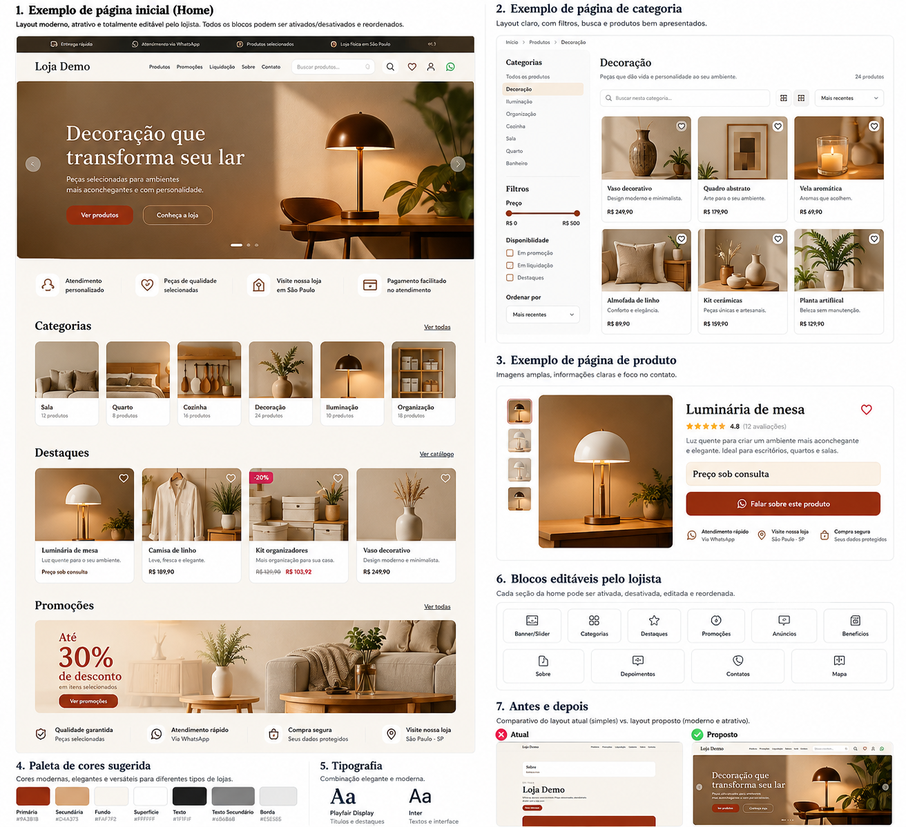

# P5 — Estética, Design System e Editabilidade Visual do Vitrio

## 1. Objetivo

Este documento define exclusivamente o padrão visual, estético e de editabilidade do Vitrio.

O objetivo do P5 é transformar o `web-public` em uma vitrine digital moderna, bonita, comercial, responsiva e altamente configurável pelo lojista, sem permitir que a personalização destrua a consistência visual do sistema.

O resultado esperado é um site com aparência de produto final profissional, e não de protótipo técnico.

---

## 2. Princípio central

A interface deve funcionar em três camadas:

```text
Design System do Vitrio
        ↓
Tema da Loja
        ↓
Conteúdo editável pelo lojista
```

O sistema controla:

- estrutura;
- grid;
- responsividade;
- acessibilidade;
- comportamento;
- semântica;
- proporções;
- espaçamentos;
- estados;
- animações;
- consistência dos componentes.

O lojista controla:

- logo;
- favicon;
- cores;
- tipografia dentre presets;
- imagens;
- banners;
- textos;
- ordem das seções;
- visibilidade das seções;
- estilo dos cards;
- estilo dos botões;
- raio de borda;
- sombras;
- variantes de layout;
- conteúdo promocional.

Regra principal:

```text
Customizável não significa irrestrito.
```

O lojista deve conseguir personalizar a identidade da loja sem conseguir quebrar o design.

---

## 3. Problemas visuais que o P5 deve eliminar

A interface atual não pode continuar com aparência de:

- página HTML genérica;
- catálogo improvisado;
- protótipo;
- blocos empilhados sem composição;
- cards sem profundidade;
- hero sem força visual;
- espaços vazios excessivos;
- categorias parecendo tags técnicas;
- botões sem presença;
- tipografia inconsistente;
- ausência de imagens relevantes;
- falta de ritmo visual;
- ausência de estados hover;
- falta de identidade de marca.

O P5 deve corrigir principalmente:

1. hierarquia visual;
2. composição;
3. uso de imagem;
4. tipografia;
5. espaçamento;
6. ritmo entre seções;
7. acabamento dos componentes;
8. responsividade;
9. editabilidade;
10. consistência.

---

---

# Exemplo visual de referência

A imagem abaixo é uma **referência estética e estrutural** para orientar a implementação do P5. Ela não representa um layout fixo: o objetivo é demonstrar hierarquia visual, uso de imagens, composição, cards, catálogo, produto, tipografia e blocos editáveis.



## Como interpretar esta referência

O `web-public` deve aproveitar os princípios apresentados na referência:

- hero com presença visual forte;
- imagens reais como parte central da composição;
- header limpo e profissional;
- CTAs evidentes;
- categorias com tratamento visual, e não apenas texto técnico;
- cards de produto com boa fotografia, hierarquia, preço opcional e badges;
- promoções apresentadas como campanhas visuais;
- página de categoria com filtros organizados;
- página de produto com galeria e CTA de contato evidente;
- espaços vazios intencionais e não decorrentes de falta de conteúdo;
- combinação consistente entre serif e sans-serif quando o tema escolhido pedir;
- seções independentes que possam ser ativadas, ocultadas, editadas e reordenadas pelo lojista.

### Importante

A referência visual **não deve ser copiada de forma rígida**. Ela serve para estabelecer o nível mínimo de acabamento esperado.

O sistema deve continuar obedecendo:

```text
Design System
      ↓
Preset do tema
      ↓
Configuração do lojista
      ↓
Conteúdo
```

Assim, duas lojas podem ter identidades visuais diferentes sem abandonar os padrões de qualidade do Vitrio.

---

## 4. Direção visual

O Vitrio deve seguir uma estética:

```text
Moderna
Minimalista
Comercial
Editorial
Premium
Responsiva
Acessível
```

A interface pública deve misturar:

- espaços bem respirados;
- tipografia forte;
- imagens grandes;
- cards refinados;
- contraste suave;
- bordas discretas;
- animações leves;
- CTAs claros;
- composição assimétrica quando fizer sentido;
- seções com fundos alternados;
- destaques comerciais evidentes.

---

## 5. Design System

Criar um design system próprio e reutilizável.

Estrutura sugerida:

```text
packages/ui/
├── components/
├── tokens/
├── themes/
├── icons/
├── motion/
├── typography/
└── layouts/
```

Todos os componentes públicos devem usar esse design system.

---

## 6. Tokens de design

Nenhuma tela pública deve depender de valores visuais hardcoded quando esses valores fizerem parte do tema.

### Cores

```text
--color-primary
--color-primary-hover
--color-primary-active
--color-primary-foreground

--color-secondary
--color-secondary-foreground

--color-accent
--color-accent-foreground

--color-background
--color-surface
--color-surface-muted

--color-text
--color-text-muted
--color-border

--color-success
--color-warning
--color-danger
--color-info
```

Exemplo incorreto:

```css
background: #a82f0f;
```

Exemplo correto:

```css
background: var(--color-primary);
```

---

## 7. Paleta por loja

O lojista poderá configurar:

```text
Cor principal
Cor secundária
Cor de destaque
Cor de fundo
Cor de superfície
Cor do texto
```

O sistema deve derivar automaticamente:

```text
hover
active
muted
foreground
border
contraste
```

O usuário não deve precisar configurar dezenas de tons manualmente.

---

## 8. Contraste e proteção visual

O painel deve validar combinações ruins.

Se o lojista escolher texto claro sobre fundo claro, o sistema deverá:

- alertar;
- impedir;
- ou corrigir automaticamente.

Meta:

```text
WCAG AA
```

---

## 9. Tipografia

Usar presets de tipografia em vez de permitir fontes arbitrárias.

### Preset Moderno

```text
Heading: Manrope
Body: Inter
```

### Preset Editorial

```text
Heading: Playfair Display
Body: Inter
```

### Preset Minimalista

```text
Heading: Geist
Body: Geist
```

### Preset Elegante

```text
Heading: Cormorant Garamond
Body: Manrope
```

### Preset Comercial

```text
Heading: Poppins
Body: Inter
```

---

## 10. Escala tipográfica

Criar uma escala fixa:

```text
Display XL
Display
H1
H2
H3
H4
Body Large
Body
Body Small
Caption
Overline
```

Não usar tamanhos aleatórios por página.

---

## 11. Hero

O hero deve ser o principal elemento visual da primeira dobra.

Ele não pode ser apenas:

```text
Título
Descrição
Botão
Retângulo vazio
```

Deve possuir variantes configuráveis.

### Hero A — Split

```text
Texto            Imagem
Título           Imagem
Descrição        Imagem
CTA              Imagem
```

### Hero B — Background

```text
Imagem grande
Overlay
Título
Descrição
CTA
```

### Hero C — Editorial

```text
Overline
Título grande
Texto curto
Imagem ampla
```

### Hero D — Imagem lateral

```text
Conteúdo 50%
Mídia 50%
```

### Hero E — Slider

```text
Slide 1
Slide 2
Slide 3
```

---

## 12. Configuração do hero

Painel:

```text
Aparência
└── Hero
```

Campos:

```text
Layout
Imagem desktop
Imagem mobile
Overline
Título
Descrição
CTA
Link CTA
Alinhamento
Overlay
Altura
```

---

## 13. Header

O header deverá possuir:

- logo;
- menu;
- CTA opcional;
- estado sticky;
- fundo sólido ou transparente;
- variação clara/escura;
- menu mobile.

Variantes:

```text
Logo esquerda + menu direita
Logo centralizado
Logo esquerda + busca central
```

---

## 14. Mobile header

No mobile:

```text
Logo
Menu hamburger
CTA opcional
```

O menu deverá abrir em Drawer com animação suave.

---

## 15. Navegação

O menu deve possuir:

- espaçamento consistente;
- hover;
- item ativo;
- foco acessível;
- transição;
- dropdown elegante quando necessário.

Não deve parecer texto solto no topo.

---

## 16. Botões

Variantes:

```text
Primary
Secondary
Outline
Ghost
Link
Danger
```

Tamanhos:

```text
sm
md
lg
xl
```

Estilos configuráveis:

```text
Rounded
Pill
Soft-square
```

---

## 17. Cards de produto

Estrutura:

```text
Imagem
Badge
Categoria
Nome
Descrição curta opcional
Preço opcional
CTA
```

Estados:

```text
normal
hover
featured
promotion
clearance
unavailable
```

Hover:

- elevação leve;
- zoom suave da imagem;
- aumento discreto de sombra;
- CTA mais evidente.

---

## 18. Imagens dos produtos

As imagens devem:

- possuir aspect ratio consistente;
- usar `object-fit`;
- possuir fallback;
- possuir skeleton;
- carregar WebP/AVIF;
- respeitar lazy loading.

Aspect ratios permitidos:

```text
1:1
4:5
3:4
16:9
```

---

## 19. Grid de produtos

Desktop:

```text
3 ou 4 colunas
```

Tablet:

```text
2 ou 3 colunas
```

Mobile:

```text
1 ou 2 colunas
```

---

## 20. Categorias

Categorias poderão ser exibidas como:

### Chips

```text
[ Roupas ] [ Casa ] [ Calçados ]
```

### Cards

```text
Imagem
Nome
```

### Ícones

```text
Ícone
Nome
```

### Carousel horizontal

Especialmente para mobile.

---

## 21. Seção de destaques

Estrutura:

```text
Título
Descrição opcional
CTA
Grid ou carousel
```

A seção deve usar largura máxima e composição consistente.

---

## 22. Promoções

Produtos em promoção podem mostrar:

```text
Badge Promoção
Preço anterior
Preço atual
Percentual
Período
```

Se preço estiver oculto:

```text
Produto em promoção
```

com CTA de contato.

---

## 23. Liquidação

Liquidação deve possuir identidade própria.

Exemplos:

```text
LIQUIDAÇÃO
Últimas unidades
Queima de estoque
```

Não depender apenas da cor vermelha.

---

## 24. Cupons

Os cupons devem ter aparência de cupom, não de card genérico.

Exemplo:

```text
┌──────────────────────────────┐
│ BEMVINDO5                    │
│                              │
│ 5% OFF                       │
│ Primeira compra              │
│                              │
│ válido até 30/11             │
│                  [ Copiar ]  │
└──────────────────────────────┘
```

---

## 25. Banners

Banners devem possuir:

- versão desktop;
- versão mobile;
- crop;
- link;
- alt;
- overlay opcional;
- texto opcional;
- CTA opcional.

---

## 26. Sliders

Usar Swiper ou solução equivalente.

Requisitos:

- swipe;
- autoplay opcional;
- pause on hover;
- navegação;
- dots;
- teclado;
- mobile;
- lazy loading.

Autoplay não deve ser agressivo.

---

## 27. Estrutura padrão de seção

Toda seção pública deverá seguir:

```text
Section
├── container
├── header
│   ├── overline
│   ├── title
│   ├── description
│   └── action
└── content
```

---

## 28. Espaçamento

Escala recomendada:

```text
4
8
12
16
24
32
48
64
80
96
128
```

Evitar valores aleatórios.

---

## 29. Container

Conteúdo principal:

```text
max-width: 1280px
```

com padding responsivo.

---

## 30. Ritmo visual

A página não deve ser uma sequência de blocos com a mesma cor.

Exemplo:

```text
Hero
↓
Categorias
↓
Destaques em fundo alternado
↓
Banner visual
↓
Promoções
↓
Sobre com imagem
↓
CTA
↓
Footer
```

---

## 31. Estrutura recomendada da Home

```text
Header
Hero
Categorias
Destaques
Banner
Promoções
Liquidação
Sobre resumido
Benefícios
Depoimentos
CTA
Contato
Footer
```

Todas as seções devem poder ser ativadas, desativadas e reordenadas.

---

## 32. Page Builder controlado

O Vitrio deverá possuir um editor de seções controlado.

O lojista poderá:

- ativar;
- desativar;
- reordenar;
- editar conteúdo;
- trocar mídia;
- escolher variante.

O lojista não poderá inserir HTML ou JavaScript arbitrário no MVP.

---

## 33. Estrutura dinâmica das páginas

Exemplo:

```json
{
  "sections": [
    {
      "type": "hero",
      "variant": "split"
    },
    {
      "type": "categories",
      "variant": "cards"
    },
    {
      "type": "featured-products",
      "variant": "grid"
    }
  ]
}
```

---

## 34. Variantes

Cada seção editável deverá possuir variantes limitadas.

```text
Hero:
- split
- background
- editorial
- slider

Products:
- grid
- carousel
- editorial

Categories:
- chips
- cards
- icons
- carousel
```

Isso mantém liberdade sem permitir caos visual.

---

## 35. Painel de aparência

Estrutura:

```text
Aparência
├── Identidade
├── Tema
├── Cores
├── Tipografia
├── Layout
├── Header
├── Hero
├── Home
├── Produtos
├── Banners
├── Botões
├── Footer
└── Preview
```

---

## 36. Preview

Alterações visuais devem ter preview antes de publicação.

Fluxo:

```text
Editar
↓
Preview
↓
Salvar rascunho
↓
Publicar
```

O preview deve reutilizar os mesmos componentes do site real.

---

## 37. Draft e Published

Separar:

```text
draft_theme
published_theme
```

Mudanças visuais não devem entrar em produção imediatamente.

---

## 38. Configuração do tema

Estrutura:

```text
theme_settings
```

Campos:

```text
primary_color
secondary_color
accent_color
background_color
surface_color
text_color

heading_font
body_font

button_style
radius_style
shadow_style

header_variant
hero_variant
product_card_variant
category_variant
footer_variant
```

---

## 39. Presets

O sistema deverá oferecer temas prontos.

```text
Minimal
Boutique
Modern
Editorial
Bold
Classic
Dark
```

O lojista escolhe um preset e depois altera detalhes.

---

## 40. Preset Boutique

```text
Serif heading
Sans body
Bege claro
Preto
Terracota
Imagens grandes
Cards suaves
```

---

## 41. Preset Modern

```text
Sans heading
Sans body
Branco
Cinza
Verde ou azul
Radius médio
Sombras discretas
```

---

## 42. Preset Bold

```text
Títulos grandes
Contraste alto
Cards maiores
Banners amplos
CTA forte
```

---

## 43. Motion System

Duração:

```text
fast: 120ms
normal: 200ms
slow: 350ms
```

Animações permitidas:

- fade;
- slide curto;
- scale leve;
- reveal;
- stagger;
- image zoom;
- underline;
- drawer;
- modal.

Evitar:

- bounce excessivo;
- rotação sem função;
- parallax pesado;
- animações contínuas;
- transições lentas.

---

## 44. Motion e GSAP

`Motion` será o padrão para microinterações React.

`GSAP` deverá ser usado apenas em áreas onde agregue valor visual real:

- hero;
- storytelling;
- banners;
- seções editoriais.

Não usar GSAP em todos os cards.

---

## 45. Reduced Motion

Respeitar:

```text
prefers-reduced-motion
```

---

## 46. Estados de interação

Todo elemento interativo deve possuir:

```text
default
hover
active
focus-visible
disabled
loading
```

---

## 47. Loading

Preferir Skeleton.

Evitar loaders genéricos em áreas de conteúdo.

---

## 48. Empty states

Exemplo:

```text
Nenhum produto encontrado

Tente alterar os filtros ou pesquisar outro termo.
```

Com ícone ou ilustração discreta.

---

## 49. Error states

Estrutura:

```text
Título
Descrição
Ação
```

Exemplo:

```text
Não foi possível carregar os produtos.

[ Tentar novamente ]
```

---

## 50. Página de produto

Estrutura recomendada:

```text
Breadcrumb
Galeria
Nome
Categoria
Preço opcional
Descrição
Badges
CTA
Promoção
Detalhes
Produtos relacionados
Contato
```

---

## 51. Galeria

Desktop:

```text
thumbnails + imagem principal
```

Mobile:

```text
swipe
```

---

## 52. Página de categoria

```text
Breadcrumb
Título
Descrição
Filtros
Ordenação
Grid
Paginação
```

---

## 53. Busca

Desktop:

```text
barra ampla
```

Mobile:

```text
overlay ou drawer
```

Pesquisa vazia deve mostrar mensagem e sugestões.

---

## 54. Footer

O footer deve ter presença visual.

Conteúdo:

- logo;
- descrição;
- navegação;
- contato;
- endereço;
- redes sociais;
- políticas;
- copyright.

Variantes:

```text
Minimal
Columns
Editorial
Centered
```

---

## 55. Mobile First

A interface deve ser desenhada primeiro pensando em mobile.

Não apenas reduzir o desktop.

---

## 56. Breakpoints

```text
sm
md
lg
xl
2xl
```

---

## 57. Mobile — produtos

- filtros em drawer;
- busca destacada;
- categorias em scroll horizontal;
- cards adaptados;
- CTA acessível.

---

## 58. Touch targets

Alvo mínimo:

```text
44x44 px
```

---

## 59. Acessibilidade

Meta:

```text
WCAG AA
```

Obrigatório:

- contraste;
- teclado;
- foco;
- labels;
- semântica;
- alt;
- ARIA quando necessário;
- reduced motion.

---

## 60. Uploads de imagem

O painel deve orientar dimensões.

Exemplo:

```text
Recomendado: 1600x900
Formato: JPG, PNG, WebP
```

---

## 61. Crop

O lojista deve poder ajustar crop separado para:

```text
Desktop
Mobile
```

---

## 62. Placeholder

Se não houver imagem:

- placeholder elegante;
- cor derivada do tema;
- ícone discreto.

Não usar retângulo cinza cru.

---

## 63. SEO e design

Conteúdo importante deve permanecer no HTML.

Não colocar título principal somente dentro da imagem.

---

## 64. Performance visual

Não sacrificar performance por estética.

Evitar:

- vídeos gigantes;
- imagens sem otimização;
- blur pesado;
- JavaScript excessivo;
- animações desnecessárias.

---

## 65. Core Web Vitals

Metas:

```text
LCP < 2.5s
INP < 200ms
CLS < 0.1
```

---

## 66. Painel de identidade

Campos:

```text
Logo
Logo alternativa
Favicon
Nome da loja
Slogan
```

---

## 67. Cores no painel

Campos:

```text
Primária
Secundária
Accent
Background
Surface
Text
```

Com preview imediato e validação de contraste.

---

## 68. Tipografia no painel

Selecionar preset.

Não permitir upload arbitrário de fonte no MVP.

---

## 69. Layout no painel

Configurações:

```text
Container
Radius
Shadow
Density
```

Valores predefinidos.

---

## 70. Density

```text
Compact
Comfortable
Spacious
```

---

## 71. Radius

```text
None
Small
Medium
Large
Pill
```

---

## 72. Shadow

```text
None
Soft
Medium
Elevated
```

---

## 73. Home Editor

Reordenação drag-and-drop:

```text
☰ Hero
☰ Categorias
☰ Destaques
☰ Banner
☰ Promoções
☰ Sobre
☰ Contato
```

Ações por bloco:

```text
Editar
Duplicar
Ocultar
Mover
Excluir quando permitido
```

---

## 74. Componentes do sistema

Biblioteca base:

```text
Button
Input
Textarea
Select
Checkbox
Radio
Switch
Dialog
Drawer
Tooltip
Dropdown
Tabs
Accordion
Carousel
Card
Badge
Breadcrumb
Pagination
Skeleton
Toast
Command
Sheet
```

---

## 75. Componentes públicos

```text
StoreHeader
StoreFooter
HeroSection
CategoryCard
ProductCard
ProductGrid
ProductCarousel
PromotionCard
CouponCard
BannerSection
AboutSection
ContactSection
TestimonialsSection
FaqSection
BenefitsSection
```

---

## 76. Sem hardcode de conteúdo

Incorreto:

```text
"Loja Demo"
```

Correto:

```text
tenant.store_name
```

Nenhum conteúdo comercial deve ser fixo no frontend.

---

## 77. Sem hardcode de aparência

Nenhum componente público deve depender de cor específica.

Tudo deve usar ThemeProvider e tokens.

---

## 78. ThemeProvider

Fluxo:

```text
Tenant
↓
theme_settings
↓
ThemeProvider
↓
CSS Variables
↓
Componentes
```

---

## 79. CSS Variables

Exemplo:

```css
:root {
  --color-primary: ...;
  --color-background: ...;
  --radius-card: ...;
  --shadow-card: ...;
  --font-heading: ...;
  --font-body: ...;
}
```

---

## 80. SSR e tema

O tema deve ser resolvido no servidor quando possível para evitar FOUC.

---

## 81. Segurança da customização

Não permitir no MVP:

```text
Custom CSS arbitrário
JavaScript customizado
HTML arbitrário
```

Isso evita:

- XSS;
- quebra de layout;
- inconsistência;
- problemas de suporte.

---

## 82. Customização avançada futura

Fora do MVP:

```text
Theme packages
Marketplace de temas
Custom CSS sandboxed
```

---

## 83. Ícones

Usar Lucide como padrão.

Não misturar várias bibliotecas.

---

## 84. Seção Sobre

Não usar apenas card branco com texto.

Variantes:

```text
Imagem + texto
Texto + imagem
Editorial
Mosaico
```

---

## 85. Contato

A seção deve poder mostrar:

- WhatsApp;
- telefone;
- endereço;
- horário;
- Instagram;
- CTA;
- mapa futuramente.

---

## 86. CTA

Exemplos:

```text
Falar no WhatsApp
Tenho interesse
Ver produtos
Conhecer a loja
```

O CTA principal deve ter destaque evidente.

---

## 87. Badges

```text
Novo
Promoção
Liquidação
Destaque
Exclusivo
```

---

## 88. Produto sem preço

Quando o preço estiver oculto, não deixar espaço vazio.

Opções:

```text
Preço sob consulta
```

ou somente CTA, conforme configuração.

---

## 89. Product Card Variants

```text
Minimal
Classic
Image-first
Editorial
Compact
```

---

## 90. Categoria sem imagem

Usar:

- cor suave;
- ícone;
- padrão visual;
- background derivado do tema.

---

## 91. Feedback de interação

Exemplo ao copiar cupom:

```text
Cupom copiado
```

Usar Toast discreto.

---

## 92. Cadastro de cliente

Formulário curto.

Preferência:

```text
Nome
WhatsApp ou E-mail
Aceite
```

---

## 93. Modal de cupom

Após cadastro:

```text
Código
Benefício
Validade
Botão copiar
```

---

## 94. Primeira impressão

A primeira dobra deve comunicar em segundos:

```text
Quem é a loja
O que vende
Por que olhar
Como entrar em contato
```

---

## 95. Conteúdo acima da dobra

Priorizar:

```text
Header
Hero
CTA
Imagem
```

Não começar com aviso técnico ou card institucional sem força visual.

---

## 96. Limite de largura de texto

Parágrafos não devem ocupar largura inteira em desktop.

Usar `max-width` para legibilidade.

---

## 97. O site público não é dashboard

O `web-public` deve parecer uma vitrine comercial.

Não usar visual administrativo no site público.

---

## 98. Painel administrativo

O painel pode ser mais funcional:

- sidebar;
- cards;
- tabelas;
- filtros;
- modais;
- breadcrumbs.

Contextos:

```text
Dashboard → produtividade
Public → apresentação e conversão
```

---

## 99. Preview responsivo

O editor deverá mostrar:

```text
Desktop
Tablet
Mobile
```

---

## 100. Configuração por dispositivo

Somente onde necessário:

```text
Hero image
Banner image
Crop
```

Evitar duplicar toda configuração por device.

---

## 101. SEO Preview + Design Preview

Produtos e páginas poderão mostrar:

```text
Preview visual
Preview Google
Preview social
```

---

## 102. Transições de página

Fade curto opcional.

Nunca atrasar a navegação.

---

## 103. Modal e Drawer

Modal:

- foco preso;
- ESC;
- overlay;
- responsivo.

Drawer:

- menu mobile;
- filtros;
- opções secundárias.

---

## 104. Toast

Usar para:

```text
Salvo
Publicado
Cupom copiado
Erro
```

---

## 105. Editor de tema

Layout sugerido:

```text
┌──────────────┬─────────────────────────┐
│ Configuração │ Preview                 │
│              │                         │
│ Cores        │ Site                    │
│ Fontes       │                         │
│ Hero         │                         │
│ Cards        │                         │
└──────────────┴─────────────────────────┘
```

---

## 106. Autosave

O editor poderá salvar rascunho automaticamente.

Publicação permanece manual.

---

## 107. Drag and Drop

Usar apenas para ordenação.

Não transformar o MVP em um editor livre tipo Figma.

---

## 108. Regra de editabilidade

O usuário edita:

```text
Conteúdo
Ordem
Visibilidade
Variante
Tema
Mídia
```

O sistema controla:

```text
Estrutura
Responsividade
Acessibilidade
Semântica
Comportamento
```

---

## 109. Objetivo de editabilidade

O lojista deve conseguir criar uma identidade própria sem conseguir criar um site quebrado.

---

## 110. Critérios de aceite visual

O P5 estará concluído quando:

1. a home não parecer protótipo;
2. o hero tiver composição visual profissional;
3. cards de produto tiverem variantes e estados;
4. categorias tiverem apresentação visual adequada;
5. promoções e liquidação tiverem destaque;
6. o header for moderno e responsivo;
7. o footer estiver completo;
8. mobile estiver bem resolvido;
9. tema for aplicado por tokens;
10. o lojista puder editar cores;
11. o lojista puder escolher tipografia por preset;
12. o lojista puder escolher variantes de layout;
13. o lojista puder reordenar seções;
14. houver preview;
15. draft e published estiverem separados;
16. cores principais não estiverem hardcoded;
17. componentes públicos usarem o design system;
18. animações forem discretas;
19. Core Web Vitals forem preservados;
20. WCAG AA for respeitado;
21. imagens tiverem placeholders adequados;
22. o site tiver ritmo visual;
23. espaços vazios forem intencionais;
24. CTA principal ficar evidente;
25. a loja parecer comercialmente pronta.

---

## 111. Resultado esperado

A home deve sair de:

```text
Menu
Card
Título
Retângulo
Categorias
Cards
```

para:

```text
Header premium
↓
Hero visual
↓
Categorias bem apresentadas
↓
Produtos em destaque
↓
Campanha visual
↓
Promoções
↓
Sobre com imagem
↓
Benefícios
↓
Contato forte
↓
Footer completo
```

Tudo mantendo o conteúdo administrável.

---

## 112. Stack visual

```text
Next.js
React
TypeScript
Tailwind CSS
shadcn/ui
Radix UI
Motion
GSAP
Swiper
Lucide
TanStack Query
React Hook Form
Zod
```

---

## 113. Filosofia final

O Vitrio deve oferecer uma arquitetura visual em que o lojista tenha liberdade suficiente para representar sua marca sem precisar ser designer ou desenvolvedor.

Fluxo:

```text
Design System
      ↓
Theme Engine
      ↓
Presets
      ↓
Configurações do lojista
      ↓
Seções editáveis
      ↓
Site público
```

O produto deve ser:

- bonito por padrão;
- moderno por padrão;
- consistente por padrão;
- editável por configuração;
- difícil de quebrar;
- rápido;
- responsivo;
- comercialmente convincente.

O `web-public` precisa parecer uma vitrine profissional pronta para representar uma loja real, e não uma demonstração técnica.
